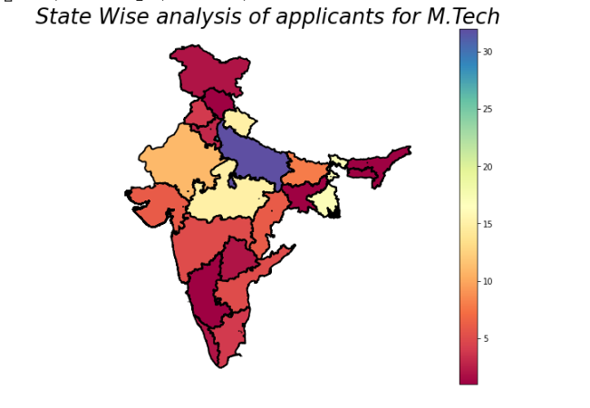

# StateWise-analysis-of-M.Tech-students-at-IIITD

This is a small project about state wise analysis of students for M.Tech 2020-2022 session at IIIT Delhi. This idea/mini-project was given as a fun activity/assignment in our Induction session by Prof.Ponnurangam Kumaraguru, Dean of Student Affairs at IIIT Delhi.

The mini-project includes the use of geopandas python library and choropleth map. (Wikipedia: A choropleth map is a type of thematic map in which areas are shaded or patterned in proportion to a statistical variable that represents an aggregate summary of a geographic characteristic within each area, such as population density or per-capita income.)

References:
  1. https://geopandas.org/
  2. https://towardsdatascience.com/walkthrough-mapping-basics-with-bokeh-and-geopandas-in-python-43f40aa5b7e9
  3. https://map.igismap.com/share-map/export-layer/Indian_States/06409663226af2f3114485aa4e0a23b4
  4. https://towardsdatascience.com/a-beginners-guide-to-create-a-cloropleth-map-in-python-using-geopandas-and-matplotlib-9cc4175ab630
  
